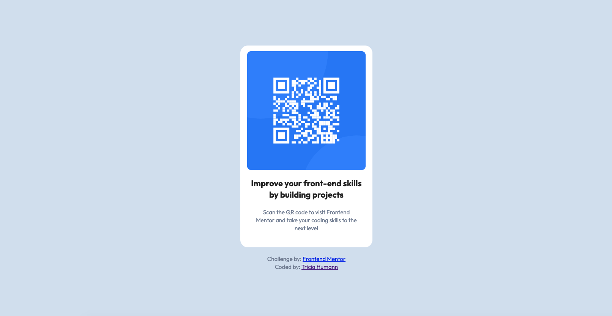

# Frontend Mentor - QR code component solution

This is a solution to the [QR code component challenge on Frontend Mentor](https://www.frontendmentor.io/challenges/qr-code-component-iux_sIO_H). Frontend Mentor challenges help you improve your coding skills by building realistic projects. 

## Table of contents

- [Overview](#overview)
  - [Screenshot](#screenshot)
  - [Links](#links)
- [My process](#my-process)
  - [Built with](#built-with)
  - [What I learned](#what-i-learned)
  - [Continued development](#continued-development)
- [Author](#author)
- [Acknowledgments](#acknowledgments)

**Note: Delete this note and update the table of contents based on what sections you keep.**

## Overview

### Screenshot

### Links

- Solution URL: [https://github.com/triciahumann/qr-code]
- Live Site URL: [https://triciahumann.github.io/qr-code/]

## My process

### Built with

- Semantic HTML5 markup
- CSS custom properties
- Flexbox
- Mobile-first workflow

### What I learned

During this project I learned that I can bring a simple design to life. This was my first project that I worked on entirely by myself outside of my Skillcrush Frontend Bootcamp. 

I learned that consistency in my actions makes a difference and that updates to the HTML happen while configuring the CSS. 

### Continued development

I want to continue to develop my flexbox skills, specicially flex-basis and grow as I'm not quite comfortable with those yet. I'd also like to work on CSS grid, but that's outside the scope of this particular project. 

## Author

- Website - [Tricia Humann's Portfolio](https://triciahumann.github.io/portfolio/)
- Frontend Mentor - [@triciahumann](https://www.frontendmentor.io/profile/triciahumann)
- LinkedIn - [Tricia Humann](https://www.linkedin.com/in/triciahumanndeveloper/)

## Acknowledgments

I'd like to thank Frontend Mentor for provided projects to work on while new developers grow their skills. 
